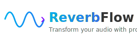
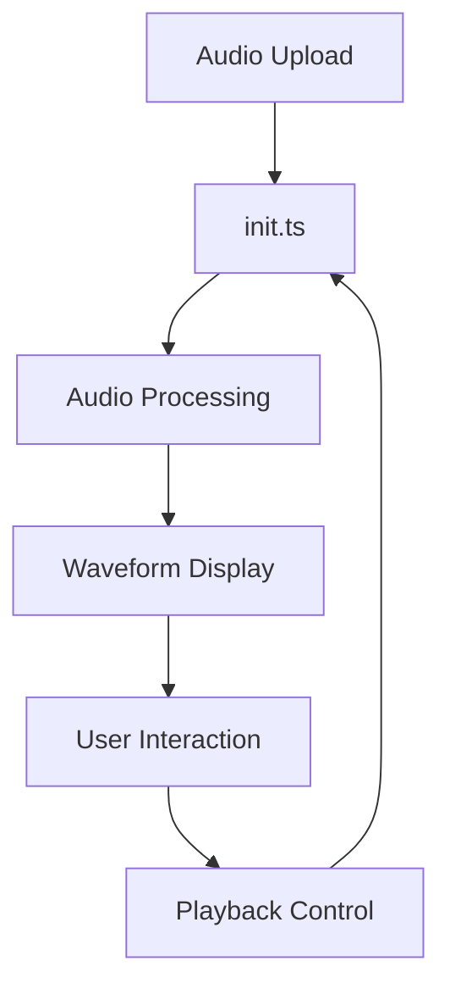

# 🎵 ReverbFlow - Professional Audio Reversal Studio

<div align="center">




**Transform your audio with professional-grade reversal tools**

[](https://www.typescriptlang.org/)
[](https://reactjs.org/)
[](https://nx.dev/)
[](https://tailwindcss.com/)
[](https://effector.dev/)

[Demo](https://reverb-flow.vercel.app/) • [Features](#-features) • [Installation](#-installation) • [Usage](#-usage) • [Architecture](#-architecture)

</div>

---

## ✨ Features

### 🎯 **Core Functionality**
- **🔄 Instant Audio Reversal** - Automatic high-quality audio reversal using Web Audio API
- **📁 Multi-Format Support** - MP3, WAV, FLAC, M4A up to 50MB
- **🎬 YouTube Integration** - Direct audio extraction from YouTube URLs
- **⚡ Real-Time Processing** - Instant preview without server uploads

### 🎨 **Professional Interface**
- **📱 Mobile-First Design** - Fully responsive with touch controls
- **🖱️ Drag & Drop Upload** - Intuitive file selection
- **🎛️ Interactive Waveforms** - Visual audio representation with draggable selection
- **🎯 Precision Controls** - Frame-accurate window selection
- **🎵 Dual Playback** - Compare original and reversed audio side-by-side

### 🔧 **Advanced Controls**
- **📐 Window Selection** - Drag start/end points or move entire selection
- **⏯️ Synchronized Playback** - Play specific audio segments
- **📊 Real-Time Visualization** - Live waveform updates
- **💾 Export Options** - Multiple format and quality settings

### 🏗️ **Technical Excellence**
- **🧩 Modular Architecture** - Nx monorepo with library separation
- **🔄 State Management** - Effector for predictable state flow
- **🎨 Modern UI** - Tailwind CSS with glass-morphism effects
- **⚡ Performance Optimized** - Efficient audio processing and rendering

---

## 🚀 Quick Start

### Prerequisites

```bash
Node.js 18+ and npm
```

### Installation

```bash
# Clone the repository
git clone https://github.com/yourusername/birthday-party.git
cd birthday-party

# Install dependencies
npm install

# Start development server
npm start
```

The application will be available at `http://localhost:4200`

---

## 💡 Usage

### 1. **Upload Audio**
- **Drag & Drop**: Simply drag audio files into the upload area
- **File Browser**: Click to browse and select files
- **YouTube**: Paste YouTube URL for automatic audio extraction

### 2. **Edit Selection**
- **Drag Edges**: Resize selection window by dragging start/end handles
- **Move Window**: Drag center area to move entire selection
- **Touch Support**: Full mobile gesture support

### 3. **Play & Compare**
- **Original Audio**: Blue play button for source audio
- **Reversed Audio**: Red play button for reversed version
- **Window Playback**: Only selected portion plays

### 4. **Export Results**
- Multiple format options (MP3, WAV, FLAC)
- Quality settings (320kbps, 192kbps, 128kbps)
- Original or reversed versions

---

## 🏗️ Architecture

### **Nx Monorepo Structure**
```
birthday-party/
├── apps/
│   └── birthday-party/          # Main React application
├── libs/
│   ├── audio-uploader/          # File upload component
│   ├── compact-waveform/        # Waveform visualization
│   ├── export-modal/            # Export functionality
│   └── window-controller/       # Audio window controls
```

### **State Management Flow**


### **Libraries & Responsibilities**

| Library | Purpose | Exports |
|---------|---------|---------|
| `audio-uploader` | File upload, YouTube download | `AudioUploader`, effector stores |
| `compact-waveform` | Waveform visualization, drag controls | `CompactWaveform` |
| `export-modal` | Audio export functionality | `ExportModal` |
| `window-controller` | Playback controls | `WindowController` |

---

## 🛠️ Development

### **Available Scripts**

```bash
# Development
npm start                    # Start dev server
npm run build               # Build for production
npm test                    # Run tests
npm run lint               # Lint code

# Nx specific
npx nx serve birthday-party         # Serve main app
npx nx build audio-uploader         # Build specific library
npx nx test compact-waveform        # Test specific library
```

### **Technology Stack**

| Category | Technology | Purpose |
|----------|------------|---------|
| **Framework** | React 19 | UI library |
| **Language** | TypeScript | Type safety |
| **Build** | Nx 21.2.1 | Monorepo tooling |
| **Styling** | Tailwind CSS | Utility-first CSS |
| **State** | Effector | Predictable state management |
| **Audio** | Web Audio API | Audio processing |
| **Icons** | Lucide React | Icon system |
| **Development** | Vite | Fast build tool |

---

## 🎨 Design System

### **Color Palette**
- **Primary Blue**: Original audio controls
- **Primary Red**: Reversed audio controls  
- **Neutral Grays**: Interface elements
- **Gradient Backgrounds**: Modern glass-morphism effects

### **Typography**
- **Headings**: Inter/System font stack
- **Body**: Optimized for readability
- **Monospace**: Code and technical data

### **Components**
- **Glass Cards**: Semi-transparent backgrounds with backdrop blur
- **Interactive Elements**: Hover states and smooth transitions
- **Responsive Grid**: Mobile-first layout system

---

## 🔧 Configuration

### **Audio Settings**
```typescript
// Supported formats
const SUPPORTED_FORMATS = [
  'audio/mpeg',   // MP3
  'audio/wav',    // WAV  
  'audio/flac',   // FLAC
  'audio/mp4',    // M4A
];

// File size limit
const MAX_FILE_SIZE = 50 * 1024 * 1024; // 50MB
```

### **Tailwind Configuration**
```javascript
// tailwind.config.js
module.exports = {
  content: [
    './src/**/*.{ts,tsx,html}',
    './libs/**/*.{ts,tsx,html}',
  ],
  theme: {
    extend: {
      // Custom design tokens
    },
  },
};
```

---

## 🤝 Contributing

We welcome contributions! Please see our [Contributing Guide](CONTRIBUTING.md) for details.

### **Development Workflow**
1. Fork the repository
2. Create feature branch (`git checkout -b feature/amazing-feature`)
3. Commit changes (`git commit -m 'Add amazing feature'`)
4. Push to branch (`git push origin feature/amazing-feature`)
5. Open Pull Request

### **Code Standards**
- TypeScript for type safety
- ESLint + Prettier for code formatting
- Conventional Commits for commit messages
- Component-driven development

---

## 📄 License

This project is licensed under the MIT License - see the [LICENSE](LICENSE) file for details.

---

## 🙏 Acknowledgments

- **Web Audio API** - For powerful browser-based audio processing
- **Nx Team** - For excellent monorepo tooling
- **Tailwind CSS** - For rapid UI development
- **Effector** - For predictable state management
- **Lucide** - For beautiful icon system

---

<div align="center">

**Built with ❤️ and modern web technologies**

[⭐ Star this repo](https://github.com/yourusername/birthday-party) | [🐛 Report Bug](https://github.com/yourusername/birthday-party/issues) | [💡 Request Feature](https://github.com/yourusername/birthday-party/issues)

</div>
